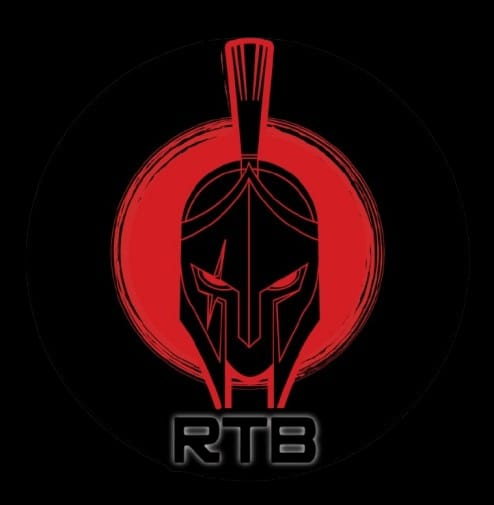

# Cyber Agent - AI-Powered Penetration Testing with Claude Code

> **RedTeam Barranquilla** - Automating penetration testing using Claude Code AI agents

<a href="https://redteambq.co/"></a> [](https://redteambq.co/)
[](LICENSE)
[](https://claude.ai/code)
[](https://www.hackthebox.com/)
[](https://www.kali.org/)
[](https://github.com/waybarrios/cyber-agent)
[](https://github.com/waybarrios/cyber-agent)
[](http://www.pentest-standard.org/)
[](https://attack.mitre.org/)

AI-powered penetration testing system using Claude Code agents. Designed for HackTheBox challenges and authorized security assessments.

---

## Features

- **Automated Attack Execution** - AI agent performs reconnaissance, enumeration, exploitation, and privilege escalation
- **Professional Report Generation** - Generates executive and technical security reports
- **Discovery-Based Approach** - Agent discovers credentials and vulnerabilities during execution
- **PTES Methodology** - Follows Penetration Testing Execution Standard
- **MITRE ATT&CK Mapping** - Maps techniques to ATT&CK framework

---

## Agents

| Agent | Description | Use Case |
|-------|-------------|----------|
| `redteam-agent` | Executes penetration testing attacks | Reconnaissance, exploitation, privilege escalation |
| `report-agent` | Generates security reports | Executive summaries, technical documentation |

---

## Quick Start

### Prerequisites

```bash
# On Kali Linux / Parrot OS
sudo apt update
sudo apt install nmap ike-scan hashcat gcc build-essential

# Install Claude Code CLI
# See: https://claude.com/claude-code
```

### 1. Clone the Repository

```bash
git clone https://github.com/waybarrios/cyber-agent.git
cd cyber-agent
```

### 2. Connect to Target Network

```bash
# For HackTheBox
sudo openvpn your_htb_vpn.ovpn
```

### 3. Start Claude Code

```bash
claude
```

### 4. View Available Agents

```
/agents
```

This displays all available agents including `redteam-agent` and `report-agent`.

---

## Using the Agents

### Red Team Agent

**Purpose**: Execute penetration testing attacks against a target.

**How to invoke**:
```
Attack the target machine at {TARGET_IP}
```

or explicitly:
```
Use the redteam-agent to pentest {TARGET_IP}
```

**What it does**:
1. Shows attack plan and waits for confirmation
2. Performs TCP and UDP port scanning
3. Enumerates discovered services (IKE/IPsec, SSH, etc.)
4. Cracks credentials using discovered hashes
5. Gains initial access via SSH
6. Escalates privileges (CVE exploitation)
7. Captures flags (user.txt, root.txt)
8. Documents all findings

**Important**:
- The agent will ask YOU to run sudo commands (like UDP scans)
- The agent DISCOVERS information during the attack - nothing is hardcoded

### Report Agent

**Purpose**: Generate professional security reports from attack findings.

**How to invoke**:
```
Generate the security report
```

or explicitly:
```
Use the report-agent to create the penetration testing report
```

**What it generates**:
- `PTR-{DATE}_executive.md` - Executive summary for management (non-technical)
- `PTR-{DATE}_technical.md` - Full technical report with evidence

---

## Attack Methodology (PTES)

| Phase | Objective | Tools |
|-------|-----------|-------|
| 1. Reconnaissance | Port scanning | nmap |
| 2. Enumeration | Service analysis | ike-scan |
| 3. Credential Attack | Hash cracking | psk-crack, hashcat |
| 4. Initial Access | Remote shell | ssh |
| 5. Privilege Escalation | Root access | gcc, exploits |
| 6. Post-Exploitation | Evidence collection | - |

---

## Project Structure

```
cyber-agent/
├── README.md                     # This file
├── CLAUDE.md                     # Claude Code instructions
│
├── .claude/agents/               # Agent definitions
│   ├── redteam-agent.md          # Red Team Agent
│   └── report-agent.md           # Report Writer Agent
│
├── agents/
│   ├── redteam_agent/            # Red Team documentation
│   │   ├── CONTEXT.md            # Quick start guide
│   │   ├── SKILLS.md             # Attack procedures
│   │   ├── TODO.md               # Attack plan
│   │   ├── output/               # Command outputs
│   │   └── sessions/             # Session data
│   │
│   └── report_agent/             # Report Writer documentation
│       ├── CONTEXT.md            # Quick start guide
│       ├── SKILLS.md             # Report procedures
│       └── TODO.md               # Report tasks
│
└── reports/                      # Generated reports
```

---

## Reading Agent Skills

View what each agent can do:

```bash
# In Claude Code
Read agents/redteam_agent/SKILLS.md
Read agents/report_agent/SKILLS.md
```

---

## Session History

Each agent saves session progress for continuity. Read previous sessions to see what was done:

```bash
# Red Team Agent sessions
Read agents/redteam_agent/sessions/000_20251229_setup_session.md

# Report Agent sessions
Read agents/report_agent/sessions/000_20251229_setup_session.md
```

**Session format**: `{NNN}_{YYYYMMDD}_{target}_session.md`

Sessions include:
- Completed phases/tasks
- Discovered information
- Commands executed
- Next steps

---

## Sudo Commands

The agent cannot run sudo commands directly. When a command requires elevated privileges:

1. The agent shows you the exact command
2. You run it manually in your terminal
3. You paste the output back to the agent
4. The agent continues the attack

**Example**:
```
Agent: "I need to run a UDP scan. Please execute:
        sudo nmap -sU -sV -p 500,4500 {TARGET_IP}"

You: [run command and paste output]

Agent: [analyzes results and continues]
```

---

## Vulnerabilities Covered

| ID | Title | Severity | CVSS | CVE |
|----|-------|----------|------|-----|
| VULN-001 | IKE Service Exposed | MEDIUM | 5.3 | - |
| VULN-002 | IKE Aggressive Mode | HIGH | 7.5 | - |
| VULN-003 | Sudo Privilege Escalation | CRITICAL | 8.1 | CVE-2025-32463 |

---

## Standards & Frameworks

- **PTES** - Penetration Testing Execution Standard
- **OWASP OPTRS** - Penetration Test Reporting Standard
- **MITRE ATT&CK** - Adversarial Tactics & Techniques
- **CVSS v3.1** - Vulnerability Scoring

---

## Example Workflow

```
┌─────────────────────────────────────────────────────────────┐
│                    ATTACK WORKFLOW                          │
├─────────────────────────────────────────────────────────────┤
│                                                             │
│  User: "Attack the machine at 10.10.11.X"                  │
│                    │                                        │
│                    ▼                                        │
│  ┌─────────────────────────────────────┐                   │
│  │         redteam-agent               │                   │
│  │  • Shows attack plan                │                   │
│  │  • Waits for confirmation           │                   │
│  │  • Executes 6 PTES phases           │                   │
│  │  • Discovers credentials            │                   │
│  │  • Captures both flags              │                   │
│  └─────────────────┬───────────────────┘                   │
│                    │                                        │
│                    │ attack_complete.json                   │
│                    ▼                                        │
│  ┌─────────────────────────────────────┐                   │
│  │         report-agent                │                   │
│  │  • Reads attack findings            │                   │
│  │  • Generates executive summary      │                   │
│  │  • Generates technical report       │                   │
│  └─────────────────┬───────────────────┘                   │
│                    │                                        │
│                    ▼                                        │
│            reports/*.md                                     │
│                                                             │
└─────────────────────────────────────────────────────────────┘
```

---

## Contributing

This project is maintained by **RedTeam Barranquilla**. Contributions are welcome!

1. Fork the repository
2. Create a feature branch
3. Submit a pull request

---

## Disclaimer

⚠️ **AUTHORIZED USE ONLY**

This tool is designed for:
- HackTheBox lab environments
- Authorized penetration testing engagements
- Security research and education

**Never use on systems without explicit written permission.**

---

## Community

<p align="center">
  <a href="https://redteambq.co/">
    
  </a>
</p>

<p align="center">
  <strong>RedTeam Barranquilla</strong> - Security research and ethical hacking community
</p>

<p align="center">
  <a href="https://redteambq.co/">
    
  </a>
  <a href="https://www.instagram.com/redteambq/">
    
  </a>
</p>

- **Focus**: Penetration testing, CTF challenges, security automation
- **Location**: Barranquilla, Colombia

---

## License

MIT License - See [LICENSE](LICENSE) for details.

---

## Keywords

`penetration-testing` `red-team` `claude-code` `ai-agents` `hackthebox` `cybersecurity` `ethical-hacking` `ptes` `mitre-attack` `vulnerability-assessment` `security-automation` `kali-linux` `ctf` `infosec`
